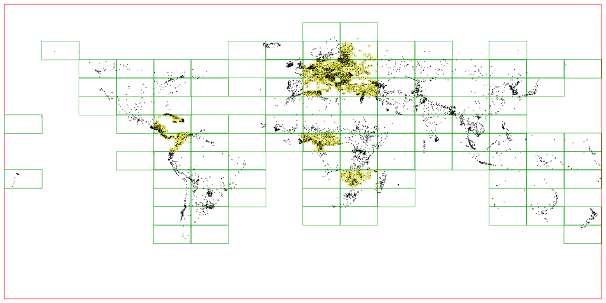
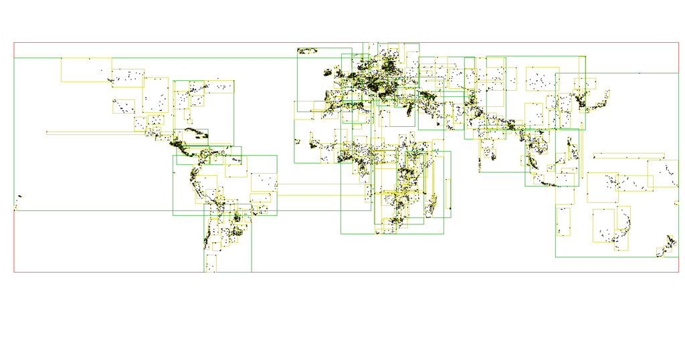

# ptree

[](https://godoc.org/github.com/tidwall/ptree)


This package provides an in-memory data structure for storing points.

Under the hood it stores points in a tree structure where nodes are spatially split evenly over a 16x16 grid and leaf nodes hold up to 256 points each.



It has an api that works a lot like the [tidwall/rtree](https://github.com/tidwall/rtree) library, but ptree is limited to only storing point while rtree can store points and rectangles. It's also structurally closer to an quadtree than an rtree.

Here's what the R-tree looks like in comparison




## Performance

The following benchmark inserts 1,000,000 random points, searches for each point, and then deletes each point.

**P-tree**

```
insert:  1,000,000 ops in 225ms, 4,449,671/sec, 224 ns/op
search:  1,000,000 ops in 287ms, 3,485,059/sec, 286 ns/op
delete:  1,000,000 ops in 220ms, 4,545,320/sec, 220 ns/op
```

**R-tree**

```
insert:  1,000,000 ops in 645ms, 1,551,015/sec, 644 ns/op
search:  1,000,000 ops in 612ms, 1,634,557/sec, 611 ns/op
delete:  1,000,000 ops in 974ms, 1,026,674/sec, 974 ns/op
```

*MacBook Pro 15" 2.8 GHz Intel Core i7*

## License

ptree source code is available under the MIT License.
